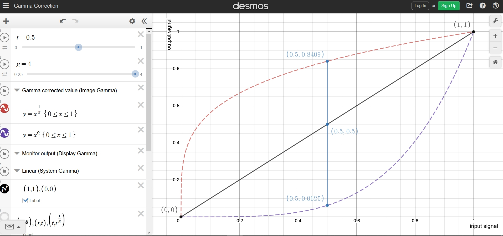
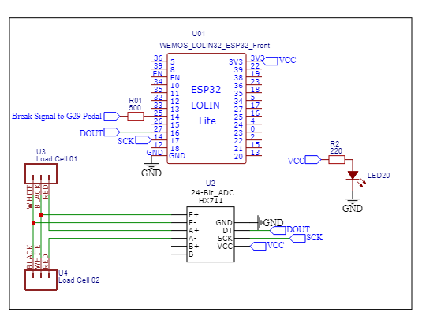
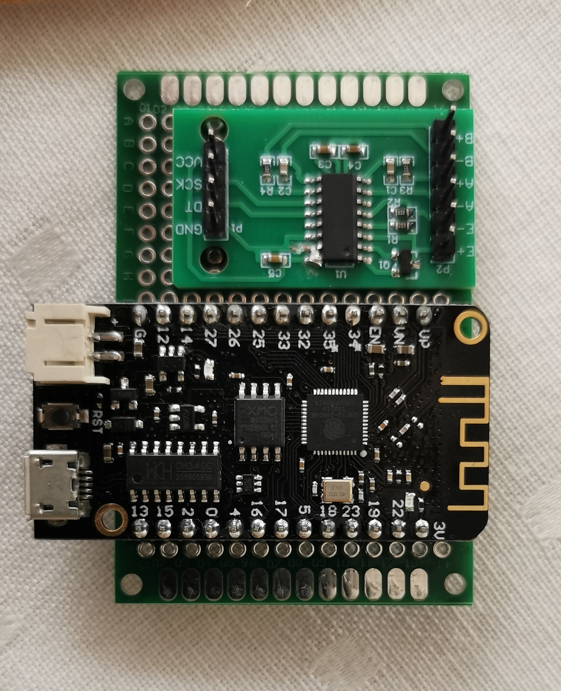
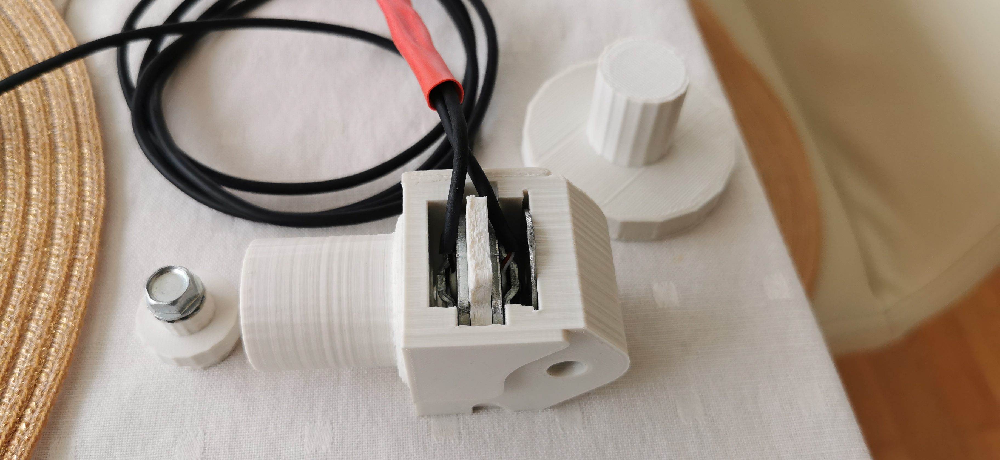
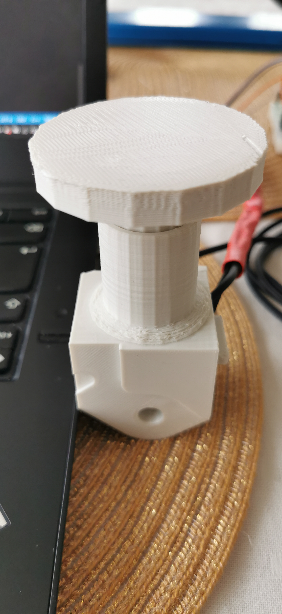
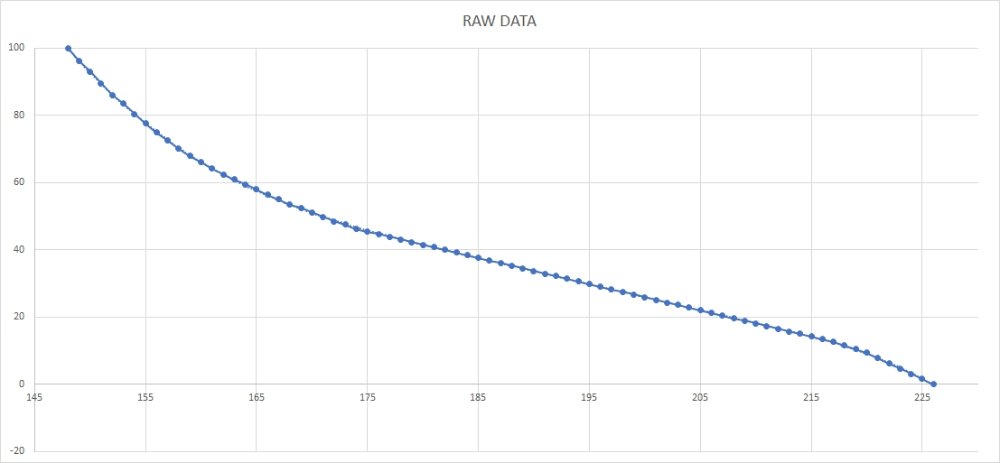
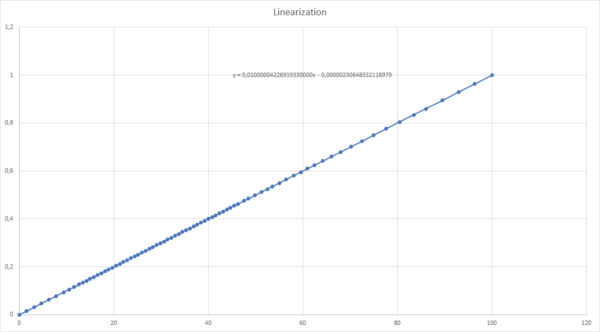

# Logitech-G29-Load-Cell

I will not repeat the text what you can find in the "References" and keep the story short:

My ideas to develop this program was due to the inspiration and using the ideas of the References:

# References
1) https://github.com/GeekyDeaks/g29-load-cell (original idea did come from here)
2) https://github.com/Skidude88/Skidude88-G29-PS4-LoadCell-Arduino/wiki (original idea did come from here)
3) https://github.com/olkal/HX711_ADC (library for the HX711 I did use)
4) https://github.com/iforce2d/thrustTester (to get the default setup of the HX711 from 10 to 80 Hz, my HX711 did end up with 89 Hz)
5) https://circuitjournal.com/50kg-load-cells-with-HX711 (wiring with 2 cells)
6) https://www.youtube.com/watch?v=iywsJB-T-mU (at 7:15, due to ESP32 speed)
7) https://www.youtube.com/watch?v=99u9cy7Mnl4 (for mod the rubber to simulate more like a load cell)
8) Google Store: Serial Bluetooth Terminal from Kai Morich
9) Gamma Calculation: https://www.desmos.com/calculator/swnathc6og

and I will not refer it more in the text, since it is a mix overall and all of them above did contribute to my result.

The reason for this is that the G29 use pot.meter from 0-100% break over distance => give the output voltage to regulate corresponding break %.
The force feedback from the spring is more or less linear and at the end we touch a rubber what will simulate a higher pressure but for the muscle memory is difficult to memorize the breaking point/level/force to get a constant good breaking especially in trail breaking is difficult. 
With a load cell we are simulating closer to real hydraulic breaks in real life where we need over proportional force curve to reach higher break.

Then the G29 and PS4 do not give any possibilities to trim the break to your driving style and this was also one of my reason to have a micro controller so that I could manipulate the output values to fit my braking conditions.

# Shopping List:
1) Load Cells with HX711 
2) Micro controller 
3) Enclosing for the Micro Controller/HX711 and for the Load Cells
4) Resistors (500 and 220 Ohm) and cables

# How-to and why

To use PWM signal to generate the needed voltage range was not good if not using a low filter or a DAC. Since I am using ESP32 anyway to other Arduino projects and they are cheap (at Amazon go under 6 Euro, included delivery) is a very unexpensive MC.

The advantage:
1) rel. fast 2xCPU with 32 bits
2) 2 x8 bit DAC (range 0-255)
3) Bluetooth for serial com. for changing parameters in the setup/trimming the break
4) Voltage range 0-3.3V fits anyway to the G29 what also is in this range

That was the reason to use ESP32 and as I was work with the project I wanted to "simulate" a "PWM" with my DAC between 2 values and here the multitask function of the ESP32 was perfect, letting the main program calculate the values for breaking and if a needed value was between, let’s say 231 and 232 I would let the DAC jump between 231 and 232 in an constant loop (of course calculated how many times of 231 and 232 to get the right simulated value let say 231.12) so in this case the task would not have any "delay" but just looping and looping with the latest known values until the task did get new values. Fantastic the ESP32 :)

Another issue known is that the G29 let’s say your breaking at 80% distance on the break is not equal to 80% in your PS4. G29 have an over exponential curve and I had to find out the values so that I could do a linearization of the curve (also my references are referring about this issue). After finding 0% break and 100% I had the outer points (min/max). So, 50% must be between, well was not as explained above. How to find 50%? I did find the bit value what was correspond to 50% in the game. Let’s say 0% was 210 and 100% 140 => (140+210)/2 = 175 in the DAC as bit but was not. So, you then change the bit value until you get the 50% in the game (look at the TV/Monitor and adjust the bit value until you see the column reach 50% in my case GT Sprot). So now the work was to check for many different %-point between 0 and 100% after this I could make a load array, you could also use a function but is quicker to use points in an array and calculate the output between 2 points.

Then I wanted to have a gamma factor to adjust the bias of the curve to fit my way of breaking. 
G>1.0 means that the break% is increasing over proportional, G<1.0 the opposite. G = 1 linear.

Pic. 0) see References #9, Gamma Calculation: https://www.desmos.com/calculator/swnathc6og. 
Red dotted line gamma = 4, Blue dotted line gamma = 0.25 and black line gamma = 1 = linear

Then the break needed a dead zone, means your break don’t start at zero Kg but at example 0.2 Kg.
Then the break needed a max load = 100% break, so if you hit the break more than max load => 100% break.
Then I did read in IRacing that the max load = 100% could be reduced to a %, let’s say 80%, means if you break at max load = 100% (normally) it would be 80%, so I also implemented this (never know if I will do IRacing but anyway good to have).
Then I wanted to send over the air serial commands to the ESP32 to change parameter for my breaking if trimming was needed during the race (rather between the race or qualifying).
Then of course encloser for the brake system and for the ESP32/HX711 (see 3D files)

That is all in a nut-shell.

Im an engineer and not a programmer so could be that my programming is dirty, so I do not mind if somebody would pimp it up, but it works and it works like a charm.

# Circuit/Wiring/PCB

Pic. 1) See Ref. 5) https://circuitjournal.com/50kg-load-cells-with-HX711 (wiring with 2 cells)

Pic. 2) Soldering ESP32 & HX711 on a small PCB, wiring after circuit diagram (see Pic. 1 above)

# 3D Print / Encloser

yes, I know old filament so not the nicest but did work perfect anyway ;)

Pic. 3) left part: plunger what is pushing the load to the load cell, mid part = encloser for the 2 load cells, right part = calibrator (see Pic. 4)

Pic. 4) the Calibrator is just to have a platform to put load on as one-time calibration for weight. I did use 2x1Kg as reference 

# STL Files for the Break and for the ESP32 Box:

See folder STL_BREAK and STL_BOX:
https://github.com/europer/Logitech-G29-Load-Cell/tree/main/STL_BOX
https://github.com/europer/Logitech-G29-Load-Cell/tree/main/STL_BREAK

# Linearization Results:

Pic. 5) The result of the raw data in a diagram. Y: Break force [%] X: Voltage in 8 Bit (0-255 = 0-3.3V)

Pic. 6) From Pic 5 the Load was linearized (from 0-1 and 0-100%) so that 50% load input = 50% break in game.

The load array (is in the Arduino program) resulted into the following load array with 79 points:

float load_percent[79] = {1.0, 0.963, 0.93, 0.895, 0.86, 0.835, 0.804, 0.776, 0.749, 0.725,
                          0.701, 0.68, 0.66, 0.642, 0.625, 0.609, 0.595, 0.58, 0.564, 0.55,
                          0.535, 0.525, 0.512, 0.498, 0.485, 0.475, 0.462, 0.455, 0.447, 0.439,
                          0.431, 0.423, 0.416, 0.408, 0.4, 0.392, 0.384, 0.377, 0.369, 0.361,
                          0.353, 0.345, 0.337, 0.33, 0.322, 0.314, 0.306, 0.298, 0.291, 0.283,
                          0.275, 0.267, 0.259, 0.252, 0.247, 0.236, 0.228, 0.220, 0.212, 0.205,
                          0.197, 0.189, 0.181, 0.173, 0.166, 0.158, 0.15, 0.142, 0.134, 0.127,
                          0.116, 0.105, 0.094, 0.078, 0.063, 0.047, 0.031, 0.016, 0.0};
                          
How to understand this:
We have after calibration the min and max point/break: 
min break = 147 and max break = 227 in voltage this again correspond to a weight from your load cell, let’s say:
min break = 1.0 Kg and max break = 10.0 Kg.

We now map the input (what is the kg) to output what we need to as voltage out to correspond to the weight/force:

Let’s say we are pushing with a force of 5.5 kg.

In the program this we use the mapping function:
Syntax: mapping(weight in,min break kg, max break kg, min output, max output). //own function, yes you can use the map what Arduino have, but sometimes I like my own routines.

weight_in_percent = mapping(5.5, 1.0, 10.0, 0.0, 1.0) and yes output will be 0.50 in this case ;).

From the load_percent array 0.50 is between nr 22 = 0.512 and nr 23 = 0.498 (counting with 0 as first value), the program will loop trough the array to see where weight_in_percent. 
The laod_perecent range is 79 points and the max/min break from 147 to 227 = 80, not same steps so we need to map this too.

lower = mapping(22, 78, 0, 227, 147) = 170.
upper = mapping(23, 78, 0, 227, 147) = 169.

Mean when the ESP32 send a DAC with the bit 170 and 169 we would get 50% break load, without the linearization the program would send out (147+227)/2 = 187 to DAC.
If we look at Pic. 5 this would result into approx. 37% breaking and not 50%.

The program calculates out of 10 how many times it must be lower and upper so that the task (FreeRTOS) to "simulate" a PWM between 2 DAC signal. 
In this case it would be 8 times 170 and 1 time 169 due to rounding.
If there is no new update from the load cell or/and the load value is the same it will just loop and loop these values until new values comes in.
Since this task operate without interference there are no timer since the task will be relative constant in time and performance.
Later in text you can see a short video from the oscilloscope and simulate a sinus curve and we will see that for this application is more the good enough.

In Arduino, DAC1 = Pin 25 for ESP32 (see ESP32 reference, DAC1 = 25, DAC2 = 26):.
dacWrite(DAC1, 170); x 8 times. 
dacWrite(DAC1, 169); x 1 time.

In this video (sorry was a video for my father-in-law and he is a master in electronic and it was in Norwegian).
we see the first part with Gamma factor = 1 (linear) then with Gamma 4.0 and then with Gamma = 0.25.

https://github.com/europer/Logitech-G29-Load-Cell/blob/main/img/Osci.mp4

# AoB

I did cut the outer valve 10mm because due to shorter distance due to the new inner valve (where the load cell is installed into) takes space in direction to the pedal I personally needed 10mm more. 
I did also increase the original rubber as in Reference 7) https://www.youtube.com/watch?v=99u9cy7Mnl4 (for mod the rubber to simulate more like a load cell).
Here you need to find your length of the rubber you need, I did increase my new "rubber" so that I had 1,5times the length from the original, but after cutting the 10mm above it was then to short, rather 2times would be better. The reason is very weak spring, first when I hit the rubber the weight goes high. I do compensate this with a Gamma of 1.8 but I will further change the spring to a lot stiffer version. This part everybody needs to find at its own and I can’t give any preference what is good or bad, since this is individual.

Regards the libary, in PlatformIO my local libaries are (default) in hidden folders, so as I did upload everything thouse files did not go into my github, therefore I did save them in the folder "lib". You just download them and put it where you need it in you libary system, you need perhaps to change the #inlcude from "....." to #inlcude from <.....> and then it should work for all IDE's

Did it help me, YES, my lap time did reduce in average up to 3 sec and not just that, my laps are constant, less errors in general, so for around 15 Euro investment a great update, I think the best update you can do for sim racing!!!

# Using the serial commands

over USB or BT, see Reference 8) Google Store: Serial Bluetooth Terminal from Kai Morich.
1) t = for TARA the load cells.
2) c = for calibrate the load cell, pushing pedal to your desired max break and 2nd push for min break.
3) v = for voltage calibration (max break and min break, it use the dacWrite(DAC1, wanted bit for min or max break)).
4) e = read out the storage values in the eeprom since mostly we will not change values and just play the game when we have the wanted parameter ;).
5) a = read out what is in RAM at given time, if you use "e" to read out eeprom it will change the values in the RAM if they could be different, since you dont need to save new values!!!.
6) w = in BT-App and www = at direct conection between ESP32 and PC. Here we calibrate the load cell with known load, use the calibrator (see Pic. 4) and put know load on it, I was using 2x1kg manuall weights, but you can also use a liter of water, or 1 kg Sugar, what ever. This is just to know for your interesst what is acctually the load in Kg but is not needed, but you need to but a value here for the first time. If you dont have a refrence value push a bit, and give 1000 in (what would be normaly 1000g=1kg).
7) s = to have serial output of the load your have at given time (every 1 sec an new serial.print).
8) l = here you can fine tune your 'c' directly into kg (max/min).
9) r = reboot the ESP32.
10) n = using the raw data or noralisation with gamma factor.
11) i = simulate 1=sinus curve, 2=0,25,50,75,100% load and default is 0 what is the load cell itself.

 
